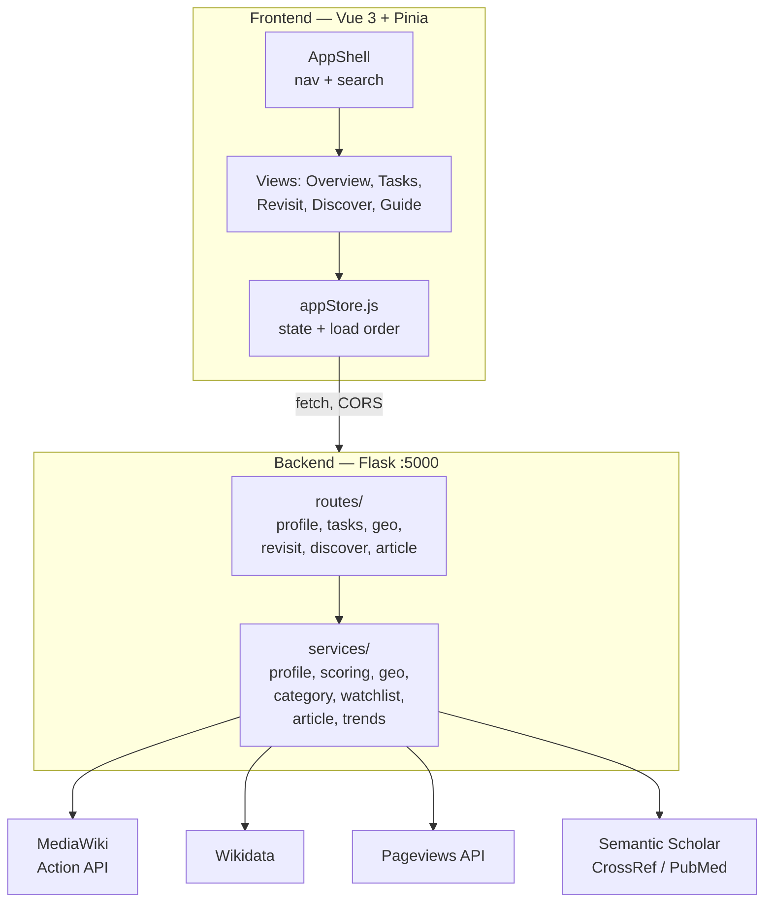
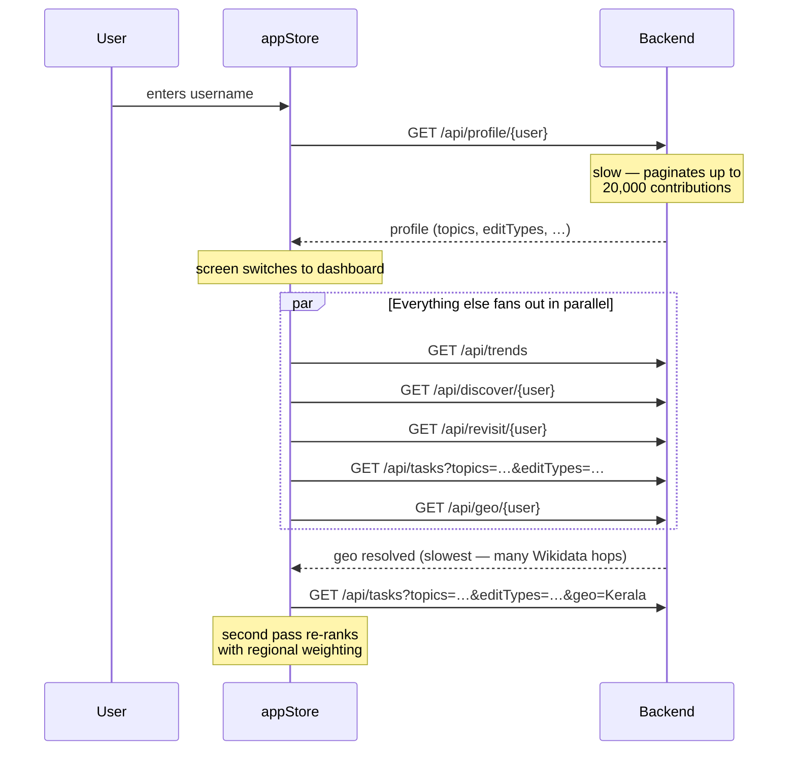

# Architecture

## Design principles

1. **No persistence.** There is no database, no session, no auth. Every request recomputes from live Wikimedia APIs. A username is the only input, and it's public data.
2. **Routes are thin, services are thick.** `routes/` only parses query params and serializes JSON. All real logic lives in `services/`.
3. **Signals flow one way.** The profile is computed first; every other feature consumes its output. Nothing feeds backwards.
4. **Degrade, don't crash.** Every external call is wrapped. A failed sub-source returns an empty list rather than failing the whole response. (This has a downside — see [[Known-Issues-and-Limitations]].)

---

## System overview

---

## Backend module map

| Module | Responsibility |
|---|---|
| `app.py` | App factory. Walks `routes/` with `pkgutil` and auto-registers any module exposing a `bp`. Adding a route file is all it takes to add an endpoint. |
| `services/http_client.py` | One shared `requests.Session` with a Wikimedia-compliant `User-Agent`. Connection pooling for free. |
| `services/profile_service.py` | Contribution fetching, edit classification, topic/geo keyword extraction, profile assembly. Also owns the canonical retrying `_wiki_get`. |
| `services/scoring_service.py` | The ranking engine. Pageviews, staleness, composite scoring, diversification. |
| `services/geo_service.py` | Walks the Wikidata place hierarchy to resolve where an editor works. |
| `services/category_service.py` | Category ↔ QID ↔ sitelink plumbing shared by Discover and Geo. |
| `services/watchlist_service.py` | Detects maintenance issues on the user's own articles (Revisit). |
| `services/article_service.py` | Single-article structural analysis and reference discovery. |
| `services/trends_service.py` | Current events, trending pages, DYK. Also owns the `wiki_get` used by task search. |

### Two HTTP helpers — a wart worth knowing

There are **two** MediaWiki helpers with near-identical jobs:

- `profile_service._wiki_get` — retries on HTTP 429 with `Retry-After` backoff, 15s timeout. Also re-exported to `category_service` and `watchlist_service`.
- `trends_service.wiki_get` — same behavior, used by trends and task search.

They were historically different: `wiki_get` had no retry and no timeout, so throttling raised straight into callers' `except Exception: return []` and silently produced **empty or half-filled task feeds**. They are now aligned, but the duplication remains and should be collapsed into one shared client.

`article_service` deliberately maintains its own third session using `urllib3`'s `Retry` adapter (exponential backoff, `status_forcelist=[429,500,502,503,504]`).

---

## Request flow: what happens on login

The frontend's load order matters — some calls take seconds, others minutes.

### Why Tasks is fetched twice

Geo resolution is the slowest call in the app — it walks the Wikidata hierarchy across many batched round-trips, each with a deliberate `time.sleep(0.25)`.

An earlier design blocked the task feed until geo resolved, so the user would see nothing for a minute or two. Worse, if geo *failed*, tasks loaded with no personalization at all and were never retried — leaving the user permanently on a generic feed.

The current design fetches tasks **twice**:

1. **Immediately** with `topics` + `editTypes` — already personalized, arrives in seconds.
2. **Again** once geo resolves, adding `geo` — re-ranked with regional weighting.

A monotonically increasing `tasksRequestSeq` guards against the older response landing last. If geo fails or resolves to nothing, the second call is simply skipped and pass 1 stands. See [[Frontend-State]].

---

## Error handling convention

| Layer | Convention |
|---|---|
| Route | `except ValueError → 404` (used for "no such user"), `except Exception → 500` with `{"error": "..."}` |
| Service (sub-source) | Catch and return empty — one dead source shouldn't kill the response |
| Frontend | Store keeps last-known-good data on failure; per-feature `*Error` state strings drive the UI |

**Caveat:** the "return empty on failure" convention makes rate-limiting *look* like "no results found." Both retrying helpers now mitigate this, but partial failures are still invisible to the user. See [[Known-Issues-and-Limitations]].
