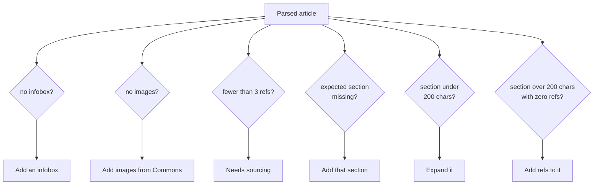
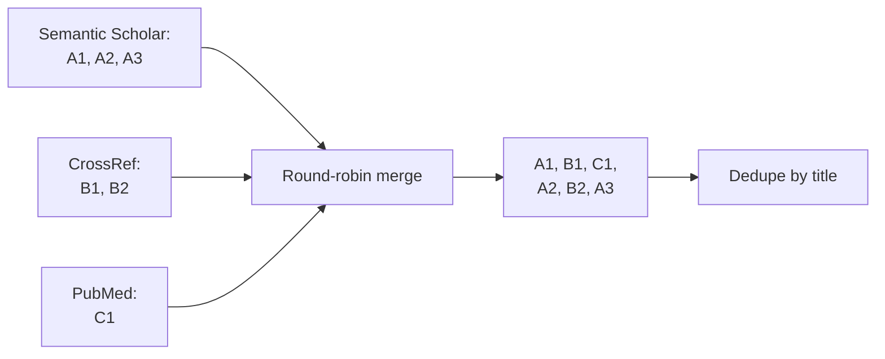

# Feature: Article Guide

**Endpoints:** `GET /api/article/<title>/guide`, `/references`, `/external-references`
**Service:** `services/article_service.py`
**UI:** Guide view (also reachable from the top-bar search on any screen)

Once a user picks a task, this answers **"what exactly do I do to this article?"** — a structural breakdown, concrete suggestions, and candidate citations.

This is the only feature that works on an arbitrary article rather than a user profile.

---

## 1. Structural analysis — `/guide`

Fetches `action=parse` with `prop=sections|wikitext|categories` and `redirects=true`.

Downloading raw wikitext (rather than rendered HTML) is what makes section-level analysis possible — it can be split on heading syntax and scanned for `<ref` tags.

### Article type detection

The article's categories are pattern-matched to pick an expected section skeleton. **First match wins**, in this order:

| Type | Category contains | Expected sections |
|---|---|---|
| `biography` | `living people`, `deaths`, `births` | Early life, Career, Personal life, Awards, Legacy, References |
| `medical` | `disease`, `medic`, `drug`, `syndrome` | Signs and symptoms, Causes, Diagnosis, Treatment, Epidemiology, References |
| `place` | `city`, `village`, `district` | History, Geography, Demographics, Economy, References |
| `event` | `event`, `war`, `election` | Background, Timeline, Aftermath, Reactions, References |
| `general` | *fallback* | History, Description, References |

This encodes Wikipedia's own genre conventions — a biography missing "Early life" is a real, actionable gap, whereas a river article missing it is not.

Matching is substring-based and lenient: an existing section named "Early life and education" satisfies the expected "Early life".

### Per-section metrics

Wikitext is split on `^=+[^=]+=+$` (heading lines). Each section gets:

| Metric | Meaning |
|---|---|
| `charCount` | Length of that section's body |
| `status` | `short` if under 200 chars, else `ok` |
| `refCount` | Count of `<ref` occurrences |

### Suggestion generation



Two exclusion rules prevent nonsense advice:

- "Expand" skips **References** and **External links** — those are supposed to be terse.
- "Add refs" skips **See also** and **External links** — link lists don't need citations.

### Response

```json
{
  "title": "Onam",
  "articleType": "event",
  "sections": [
    { "name": "History", "level": 2, "index": "1",
      "charCount": 1840, "status": "ok", "refCount": 4 }
  ],
  "missingExpected": ["Aftermath", "Reactions"],
  "suggestions": [
    { "type": "structure", "text": "Add an infobox" },
    { "type": "section", "text": "Add \"Aftermath\" section" },
    { "type": "expand", "text": "Expand \"Legacy\" — very short (88 chars)" }
  ],
  "currentSize": 24193,
  "totalRefs": 17,
  "hasInfobox": false,
  "hasImages": true,
  "cats": ["hindu festivals", "kerala culture"]
}
```

Suggestion `type` values (`structure`, `media`, `refs`, `section`, `expand`) let the UI group and icon them.

---

## 2. Wikipedia-sourced references — `/references`

Finds **related Wikipedia articles** that could serve as models or link targets.

| Parameter | Value |
|---|---|
| `srsearch` | the article title |
| `srlimit` | `5` per page |
| `sroffset` | from the `?offset=` query param |

Each of the 5 results is then run through `analyze_article_light` **in parallel** (`ThreadPoolExecutor(max_workers=5)`) so every suggestion arrives annotated with *what's wrong with that article too*.

`analyze_article_light` skips the heavy wikitext download, requesting only `sections|categories|templates`. Infobox detection falls back to scanning template names.

The article itself is filtered out of its own results (case-insensitive).

Paginated via `nextOffset` — the UI has a "load more" affordance.

```json
{
  "results": [
    {
      "title": "Vishu",
      "authors": "Wikipedia Contributors",
      "year": "2026",
      "venue": "English Wikipedia",
      "url": "https://en.wikipedia.org/wiki/Vishu",
      "citations": 1420,
      "source": "Wikipedia API",
      "doi": "",
      "whatToEdit": [{ "type": "section", "text": "Add \"Legacy\" section" }],
      "missingSections": ["Legacy"]
    }
  ],
  "nextOffset": 5,
  "total": 8213
}
```

> The `authors`/`year`/`venue`/`citations` fields are shaped like academic citations for UI consistency, but for Wikipedia results they're placeholders — `citations` is actually the article's **word count**.

---

## 3. Academic references — `/external-references`

Queries three scholarly databases in parallel (`max_workers=3`, 5s timeout each). See [[External-APIs]] for the exact parameters.

| Source | Always queried? |
|---|---|
| Semantic Scholar | Yes |
| CrossRef | Yes |
| PubMed | **Only for medical topics** |

### Two deliberate relevance decisions

**PubMed is conditional.** It only indexes biomedical literature, so querying it about a temple or a film returns loosely-matched noise. It runs only when the title matches `MEDICAL_HINTS` (`medic`, `disease`, `cancer`, `virus`, `vaccine`, …).

**Results are interleaved, not globally sorted.** Each source already returns its own relevance ranking. Sorting everything by citation count buried genuinely relevant papers under famous-but-unrelated ones. So results are merged **round-robin** — 1st from each source, then 2nd from each, and so on — preserving per-source relevance. Then deduplicated case-insensitively by title.



---

## Caching and load protection

- `analyze_article`, `analyze_article_light`, `find_references`, and `find_external_references` are all wrapped in `functools.lru_cache(maxsize=128)`. Repeat views of the same article are free — but note the cache is **per-process and never invalidated**, so a long-running server serves stale analyses.
- This service uses its own `requests.Session` with a `urllib3` `Retry` adapter: 4 retries, 1.5× exponential backoff, retrying on `429, 500, 502, 503, 504`, respecting `Retry-After`.
- Setting `STRESS_TEST=1` makes `analyze_article` and `find_references` return canned fixtures with simulated latency, so load testing (`locustfile.py`) never hammers Wikipedia.
- Every endpoint returns a shaped fallback object on failure rather than a bare error, so the UI always has something renderable.
