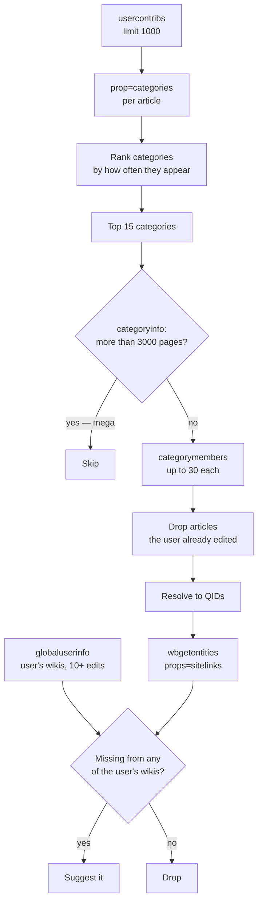

# Feature: Discover

**Endpoint:** `GET /api/discover/<username>`
**Services:** `routes/discover.py`, `services/category_service.py`
**UI:** Discover view

Answers a different question from Tasks. Not *"what should I fix?"* but **"what doesn't exist yet in my language that I'm qualified to write?"**

This targets multilingual editors — a large and underserved part of the Wikipedia community. If someone edits both English and Malayalam Wikipedia, and an article exists in English but not Malayalam, that's a concrete translation opportunity matched to their demonstrated expertise.

---

## Pipeline



---

## Step 1 — What is this editor an expert in?

Categories across the user's last 1,000 edits are counted. Frequency **is** the expertise signal: someone who edited 40 articles in `Rivers of Kerala` clearly knows that domain.

The top **15** (`TOP_CATEGORIES`) proceed.

## Step 2 — Discard mega-categories

`prop=categoryinfo` returns each category's real article count. Anything above **3,000 pages** (`MEGA_CATEGORY_THRESHOLD`) is dropped.

Categories like `Living people` (millions of members) or `Articles with short description` are administrative buckets, not topics. Expanding them would flood the results with unrelated articles and destroy the signal. Skipped ones are returned as `skippedMegaCategories` for transparency.

> `categoryinfo` uses `pages` rather than `size`, because `size` includes subcategories and files.

## Step 3 — Expand into candidates

Up to **30 members** (`MEMBERS_PER_CATEGORY`) per surviving category, ns=0 only. Articles the user has already edited are removed — they want *new* work.

When an article appears in several of the user's categories, it's attributed to the **highest-weighted** one, so its `categoryWeight` reflects its strongest connection to the user's expertise.

## Step 4 — Which languages does this user speak?

`fetch_user_wikis` reads the Meta `globaluserinfo` per-wiki breakdown and keeps wikis where:

- The URL matches `^https://([a-z0-9-]+)\.wikipedia\.org$` — excludes Commons, Wikidata, Meta
- Edit count ≥ **10** — a handful of edits doesn't mean fluency

## Step 5 — Find the gaps

`wbgetentities&props=sitelinks` returns every wiki that already has an article for each candidate's Wikidata item. Diff that against the user's wikis:

```
missingIn = user's wikis − wikis that already have the article
```

Candidates present in *all* of the user's languages are dropped — nothing to do. The rest are sorted by `categoryWeight`.

---

## Response shape

```json
{
  "username": "ranjithsiji",
  "editsFetched": 1000,
  "uniquePages": 412,
  "uniqueCategories": 1847,
  "categoriesWithQid": 623,
  "categories": [
    { "name": "Rivers of Kerala", "qid": "Q8452193",
      "wikidataUrl": "https://www.wikidata.org/wiki/Q8452193", "pageCount": 41 }
  ],
  "userWikis": [
    { "dbname": "mlwiki", "lang": "ml", "url": "https://ml.wikipedia.org", "editcount": 40219 },
    { "dbname": "enwiki", "lang": "en", "url": "https://en.wikipedia.org", "editcount": 12043 }
  ],
  "suggestedArticles": [
    {
      "title": "Chalakudy River",
      "qid": "Q2961147",
      "wikidataUrl": "https://www.wikidata.org/wiki/Q2961147",
      "fromCategory": "Rivers of Kerala",
      "categoryWeight": 41,
      "existsIn": ["enwiki", "dewiki"],
      "missingIn": [{ "dbname": "mlwiki", "url": "https://ml.wikipedia.org" }]
    }
  ],
  "skippedMegaCategories": ["Living people", "Articles with short description"]
}
```

## UI behavior

Three client-side sort modes:

| Mode | Ordering |
|---|---|
| **By relevance** | `categoryWeight` descending — strongest expertise match first |
| **By category** | Grouped under category headings, groups ordered by weight |
| **By languages missing** | Most missing languages first — highest total impact |

Each suggestion links directly to the target wiki's article-creation URL, so a user can go from suggestion to editing in one click.

## Notes and constraints

- Requires the user to have **more than one** qualifying Wikipedia. Monolingual editors get an empty `suggestedArticles` list — the feature has nothing to offer them.
- The 1,000-edit sample means very recent interests dominate.
- No quality or notability filter is applied to candidates beyond the mega-category cut, so some suggestions may be trivial articles.
