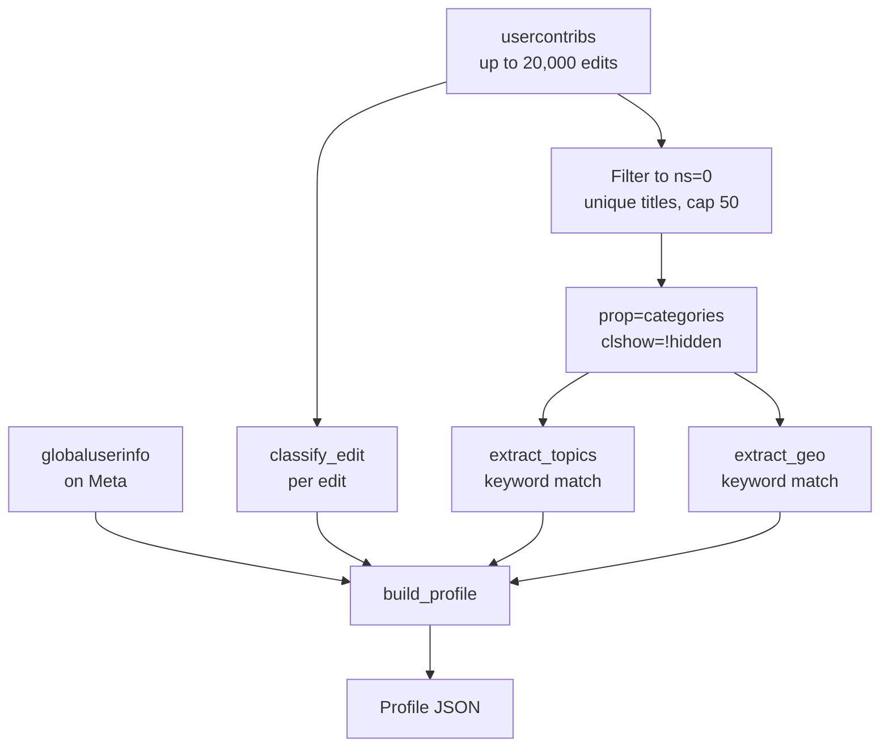
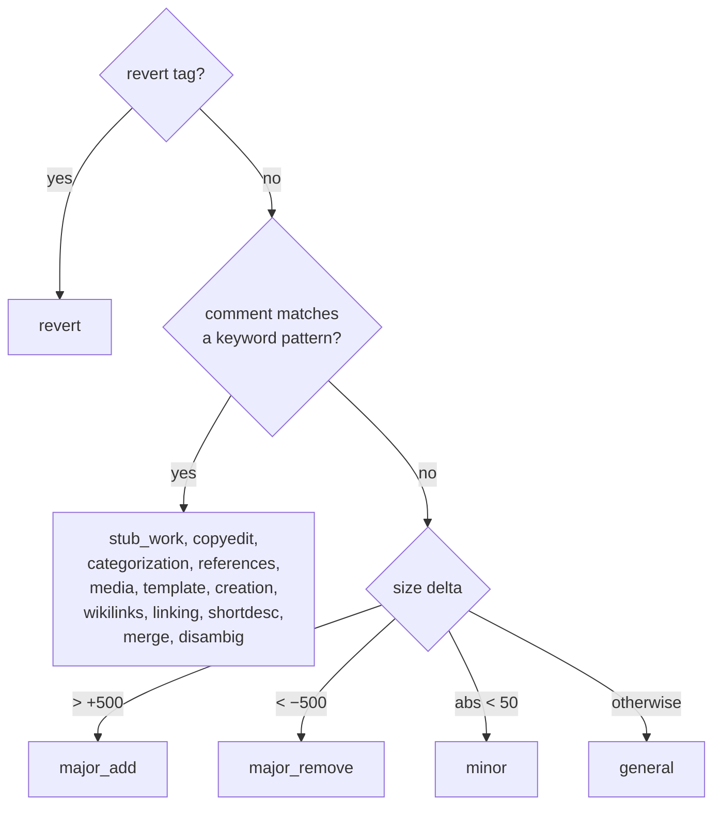

# Feature: Editor Profile

**Endpoint:** `GET /api/profile/<username>`
**Service:** `services/profile_service.py`
**UI:** Overview view

The profile is the root of the entire app. Every other feature consumes its output — if this is wrong, everything downstream is wrong.

---

## Pipeline



### Why only 50 titles get categories

The user may have edited thousands of unique articles, but `prop=categories` costs one API round-trip per 50 titles. The topic distribution converges fast, so the profile samples the **50 most recent unique articles** — recency is also a feature here, since it weights toward what the editor cares about *now*, not five years ago.

This is a deliberate accuracy-vs-latency tradeoff. It means topic detection reflects recent focus, not lifetime focus.

---

## Edit classification

`classify_edit(comment, tags, sizediff)` assigns every edit exactly one of 17 labels. It is a **first-match-wins cascade** — order matters.



**Tags beat comments; comments beat size.** A rollback is a revert even if the comment says "fixing refs." Size is only consulted when the comment is uninformative.

| Label | Trigger |
|---|---|
| `revert` | tag `mw-rollback`, `mw-undo`, or `mw-manual-revert` |
| `stub_work` | comment matches `\bstub` |
| `copyedit` | `copyedit`, `copy edit`, `grammar`, `spelling`, `typo` |
| `categorization` | `categor`, `recat` |
| `references` | `\bref`, `citation`, `source`, `\bcite\b` |
| `media` | `image`, `file:`, `photo` |
| `template` | `infobox`, `template`, `navbox` |
| `creation` | `creat`, `new article` |
| `wikilinks` | `wikidata`, `wikilink`, `interwiki` |
| `linking` | `\blink`, `orphan`, `dead.?end` |
| `shortdesc` | `short desc` |
| `merge` | `merge`, `redirect` |
| `disambig` | `disambig`, `dab` |
| `major_add` / `major_remove` / `minor` / `general` | size-delta fallbacks |

**Known weakness:** this depends entirely on editors writing meaningful edit summaries. Editors who leave blank summaries collapse into `minor`/`general`, weakening their affinity signal. See [[Known-Issues-and-Limitations]].

---

## Topic extraction

`TOPIC_KW` maps 12 topics to keyword lists. Every category name on every sampled article is lowercased and substring-matched against every keyword; each hit increments that topic's score. The **top 3** become `topTopics`.

| Topic | Sample keywords |
|---|---|
| `medicine` | medic, disease, health, hospital, drug, pharma, anatomy, surg, cancer, virus |
| `science` | science, physic, chemi, biolog, math, astrono, geolog, ecolog, genetic |
| `technology` | technol, comput, software, internet, digital, program, engineer, robot |
| `geography` | geograph, countr, city, cities, district, village, town, region, province |
| `history` | histor, ancient, mediev, century, `war `, empire, dynasty, colonial |
| `culture` | cultur, music, film, `art `, literat, novel, poet, theater, cinema |
| `biography` | birth, death, people, person, biograph, living people, alumni |
| `education` | educat, universit, school, college, academ |
| `india` | india, kerala, tamil, hindi, bengal, mumbai, delhi, malay, karnatak |
| `politics` | politic, govern, election, parliament, president, minister |
| `sports` | sport, football, cricket, basketball, olympic, athlet, soccer |
| `environment` | environ, climate, conserv, species, wildlife, ocean, forest |

If nothing matches, `topTopics` falls back to `["general"]`.

Note the trailing spaces in `"war "` and `"art "` — they prevent matching *software*, *warrant*, *Bharat*, etc.

**This list is Anglophone- and India-skewed by design** (the project's original audience), and it is the main reason topic detection is coarse. `india` is a topic, but Brazil and Nigeria aren't.

## Geographic keyword extraction (`topGeo`)

`extract_geo` runs the same keyword-matching trick against `GEO_KW` — 8 hardcoded buckets: `kerala`, `india`, `usa`, `uk`, `middleeast`, `africa`, `europe`, `asia`.

> **This is the legacy geography signal.** It is coarse and hardcoded. The real geographic feature is the Wikidata hierarchy walk documented in [[Feature-Geographic-Focus]], which resolves actual place names dynamically. `topGeo` is still returned in the profile payload but is **not** what drives task recommendations.

---

## Derived statistics

### Quality tier

Based on how often the editor's work involves reverting:

```
revert_rate = count(revert) / total_edits
```

| Tier | Condition |
|---|---|
| `high` | revert rate < 2% |
| `medium` | revert rate < 6% |
| `developing` | otherwise |

This measures edits *classified as reverts from their comments and tags* — an approximation of edit quality, not a true measure of it. Treat it as a rough signal.

### Heavily edited articles

ns=0 pages the user edited **3 or more times**, ranked by count, top 15. Feeds [[Feature-Revisit]] — repeated edits imply ownership and ongoing interest.

### Created articles

Edits classified as `creation`, top 20. Also feeds Revisit.

### Recent edits

The 15 newest edits with prebuilt `diffUrl` (`index.php?diff={revid}`) and `articleUrl` links for the Overview timeline.

---

## Response shape

```json
{
  "username": "ranjithsiji",
  "total": 285431,
  "uniqueArticles": 3120,
  "editTypes": { "general": 788, "minor": 811, "references": 363, "linking": 162 },
  "topTopics": ["india", "culture", "history"],
  "topGeo": ["kerala", "india"],
  "qualityTier": "high",
  "heavilyEdited": [{ "title": "Onam", "count": 23 }],
  "createdArticles": ["Pallichattambi", "Sinoj Varghese"],
  "recentEdits": [
    {
      "title": "Onam",
      "timestamp": "2026-07-19T08:12:00Z",
      "comment": "added refs",
      "sizediff": 412,
      "diffUrl": "https://en.wikipedia.org/w/index.php?diff=123456789",
      "articleUrl": "https://en.wikipedia.org/wiki/Onam"
    }
  ]
}
```

`total` is the **global** cross-wiki edit count from Meta, not the length of the fetched contribution list — a prolific editor's true total can far exceed the 20,000 we page through.

## How this tailors results

| Profile field | Consumed by | Effect |
|---|---|---|
| `topTopics` | Tasks | Becomes the **search query** for candidate articles, and the topic-weight ranking term |
| `editTypes` | Tasks | Top 6 keys become the affinity signal — matching task types get a bonus |
| `heavilyEdited` | Revisit | Articles checked for newly-appeared maintenance issues |
| `createdArticles` | Revisit | Articles checked for still-stub / still-unreferenced status |
| `qualityTier` | Overview | Displayed only; does not currently affect ranking |
| `topGeo` | — | Legacy; superseded by `/api/geo` |
