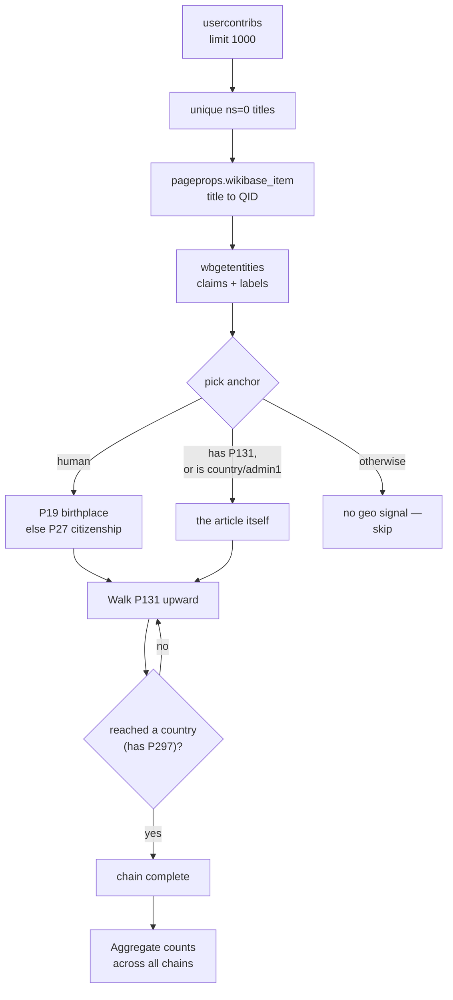
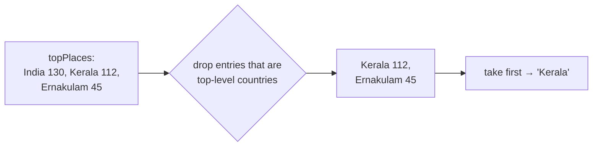

# Feature: Geographic Focus

**Endpoint:** `GET /api/geo/<username>`
**Service:** `services/geo_service.py`
**UI:** Overview (place chips) + feeds the Tasks ranking

Figures out **where in the world** an editor works — not by keyword-matching category names, but by walking Wikidata's actual place hierarchy.

If someone edits *Kochi*, *Aluva*, and *Thrissur*, Compass should learn they work on **Kerala** — even though no article says "Kerala."

---

## Why not just use keywords?

`profile_service.extract_geo` does keyword matching against 8 hardcoded regions. It can only ever recognize places someone thought to type into a Python dict — useless for an editor working on Peruvian towns or Polish villages.

This feature replaces that with a **dynamic hierarchy walk**. No hardcoded place list.

---

## Pipeline



---

## Step 1 — Anchor selection

Not every article is a place, and not every article that *mentions* a place should count. `_pick_anchor` decides what — if anything — an article contributes:

| Article subject | Anchor chosen | Rationale |
|---|---|---|
| A **person** (`P31` = `Q5`) | `P19` place of birth, else `P27` country of citizenship | A person's geography is where they're from |
| Something **nested in a place** (has `P131`) | The article itself | It's already a place, or located in one |
| A **country** (`P297`) or **first-level division** (`P300`) | The article itself | Top-level places have no `P131` but are obviously geographic |
| Anything else | **Nothing** | Deliberate — see below |

**The deliberate exclusion:** companies, films, organizations, and abstract concepts contribute **no geo signal at all**, even though they often have a country property. A user editing *Microsoft* and *The Godfather* isn't demonstrating geographic focus on Redmond and Hollywood. Requiring genuine place-hierarchy membership (`P131`) keeps the signal clean.

---

## Step 2 — Walking the hierarchy

From each anchor, follow `P131` ("located in the administrative territorial entity") upward, collecting the English label at every level:

```
Aluva  →  Ernakulam district  →  Kerala  →  India
```

| Rule | Value |
|---|---|
| Max hops | `MAX_HOPS = 6` |
| Primary edge | `P131` |
| Fallback edge | `P17` (country) when `P131` is absent |
| Stop condition | Entity has `P297` (an ISO country code) ⇒ it's a country |
| Also stops | No parents found, or entity data missing |

**Every level is kept, not just the country.** A "Kochi" edit and a "Kerala" edit are both real signal — collapsing everything to "India" would throw away exactly the specificity that makes recommendations useful.

Chains are walked **breadth-first across all anchors simultaneously** — each hop batches the next level's QIDs into a single `wbgetentities` call rather than walking each chain independently. That's what keeps this feasible over hundreds of articles.

---

## Step 3 — Aggregation

Every place name in every chain is counted:

- `topPlaces` — top 12 by frequency, all hierarchy levels mixed together
- `topCountries` — top 3, counting only each chain's final (country) element
- `articlesWithGeo` — how many articles resolved to any place at all

---

## Response shape

Real output for `ranjithsiji`:

```json
{
  "username": "ranjithsiji",
  "articlesWithGeo": 134,
  "topPlaces": [
    { "name": "India", "count": 130 },
    { "name": "Kerala", "count": 112 },
    { "name": "Ernakulam district", "count": 45 },
    { "name": "Thrissur district", "count": 12 },
    { "name": "Kochi", "count": 6 }
  ],
  "topCountries": [
    { "name": "India", "count": 130 },
    { "name": "Kingdom of Great Britain", "count": 1 }
  ]
}
```

---

## How the frontend picks one place

The Tasks endpoint accepts a **single** `geo` string, so `appStore.geoFocusName` reduces the list:

> Take the most-frequent place that is **not** itself a top-level country. Fall back to the country if nothing more specific resolved.

For the data above that yields **"Kerala"**, not "India" — country-level is too broad to be an interesting regional signal, while `Kerala` is specific enough to surface genuinely local work.



## How this tailors results

`geo` is passed to `/api/tasks` where it does **two** things:

1. **Becomes an extra search topic** — `hastemplate:"Unreferenced" Kerala` runs alongside the profile topics. This is what actually surfaces region-specific articles into the candidate pool.
2. **Earns a +0.40 ranking bonus** for candidates whose topic equals the geo name.

> Only one place from the whole resolved hierarchy is used, and matching is exact-string. Articles found under "Ernakulam district" get no bonus when geo is "Kerala". See [[Known-Issues-and-Limitations]].

## Performance

This is **the slowest endpoint in the app** — typically a minute or more. It makes many sequential `wbgetentities` batches, each followed by `time.sleep(0.25)` to respect Wikimedia rate limits, and the hierarchy walk is inherently serial (you can't know hop N+1 until hop N returns).

That is precisely why the frontend does *not* block the task feed on it — see [[Frontend-State]].
