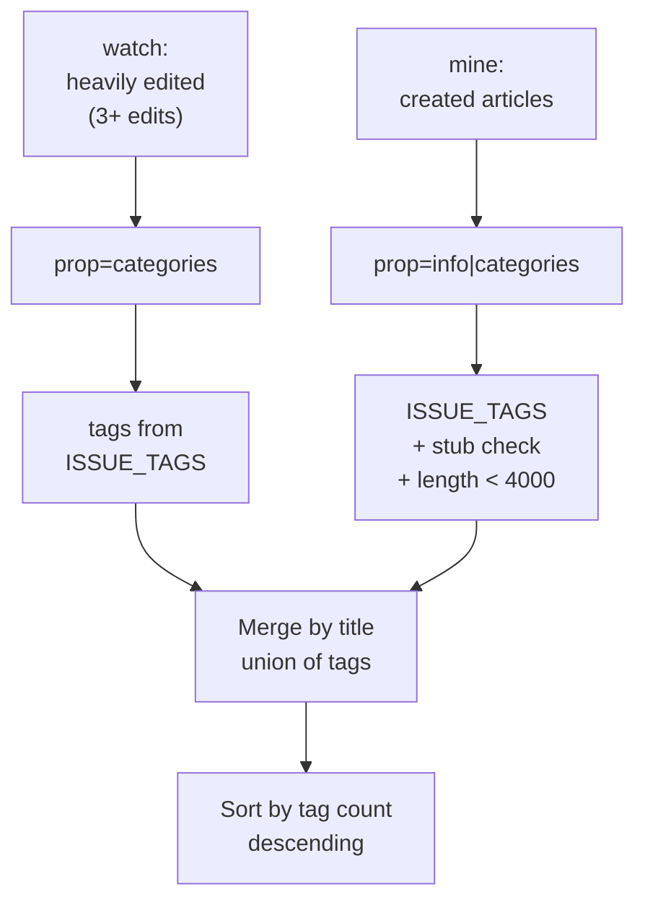

# Feature: Revisit

**Endpoint:** `GET /api/revisit/<username>?watch=…&mine=…`
**Service:** `services/watchlist_service.py`
**UI:** Revisit view

Surfaces **the user's own articles that have decayed**. Articles they poured work into that have since picked up maintenance tags, or articles they created that never grew past stub stage.

This is often the highest-value feature in the app: the editor already has context on these pages, so the barrier to acting is near zero.

---

## Request parameters

Unusually, the frontend passes the *article lists themselves* rather than the backend re-deriving them — they already exist in the profile response, so re-fetching 20,000 contributions would be wasteful.

| Param | Format | Source | Cap |
|---|---|---|---|
| `watch` | JSON `[{title, count}]` | `profile.heavilyEdited` | 15 |
| `mine` | JSON `[title]` | `profile.createdArticles` | 20 |

Both are parsed defensively — malformed JSON yields an empty list rather than a 500, and each item is type-checked before use.

---

## The key insight: hidden categories

Wikipedia tracks maintenance issues through **hidden tracking categories** whose names don't literally contain the words you'd expect:

| Actual category on the article | What it means |
|---|---|
| `Category:Articles with unsourced statements from March 2026` | citation needed |
| `Category:Articles needing additional references from June 2025` | unreferenced |
| `Category:Orphaned articles from January 2024` | orphan |

Searching for "unreferenced" would find none of these. So `ISSUE_TAGS` matches the substrings MediaWiki actually uses:

| Matched substring | Tag key | Label |
|---|---|---|
| `unsourced statements` | `add_citations` | Citation needed |
| `additional references` | `add_refs` | Unreferenced |
| `reliable references` | `add_refs` | Unreferenced |
| `lacking sources` | `add_refs` | Unreferenced |
| `orphaned articles` | `fix_orphan` | Orphan |
| `cleanup` | `cleanup` | Cleanup |
| `disputed` | `disputed` | Accuracy disputed |
| `npov` | `npov` | Neutrality disputed |
| `updat` | `stale` | Needs update |

`updat` deliberately matches both "articles needing updating" and "articles to be updated."

Multiple keywords collapse to the same key (three map to `add_refs`), and results are deduplicated by key — an article in two different "needs references" categories shows one tag.

> Note this endpoint queries `prop=categories` **without** `clshow=!hidden` — the opposite of the profile pipeline, which strips hidden categories as noise. Here they're the entire point.

---

## Two detectors



### `find_watchlist_tasks` — articles you kept editing

Checks each heavily-edited article for maintenance tags. Reason string carries the edit count as social proof:

> *You edited this 23× — Unreferenced, Citation needed*

### `find_followup_tasks` — articles you created

Same tag check, plus two extra signals from `prop=info`:

| Extra tag | Condition |
|---|---|
| `Stub` | Any category contains `stub` |
| `Could be expanded` | Page `length` < 4,000 bytes **and** not already tagged a stub |

The "not already a stub" guard prevents showing both tags for the same underlying problem.

> *You created this article — Stub, Unreferenced*

---

## Merging

An article can surface from both lists — the user created it *and* edited it repeatedly. `routes/revisit.py` merges by title, taking the **union of tags** (deduplicated by key) rather than showing it twice.

Final ordering is by **number of distinct tags, descending** — the most broken articles first. Note this is a pure count; it does not use the composite scoring engine, because these articles are relevant by construction.

---

## Response shape

```json
{
  "username": "ranjithsiji",
  "tasks": [
    {
      "title": "Mokksha",
      "source": "followup",
      "tags": [
        { "key": "add_refs", "label": "Unreferenced" },
        { "key": "stub", "label": "Stub" }
      ],
      "reason": "You created this article — Unreferenced, Stub"
    }
  ]
}
```

## UI behavior

The Revisit view builds its filter buttons **dynamically from tags actually present in the data**, so a user never sees a "Neutrality disputed" filter that would match nothing. Filtering is client-side.

## Batching

Both detectors batch titles 50 at a time (MediaWiki's `titles` cap) and skip any batch that errors, so one failed request degrades the result rather than emptying it. Non-ns-0 pages returned by the API are filtered out defensively.
