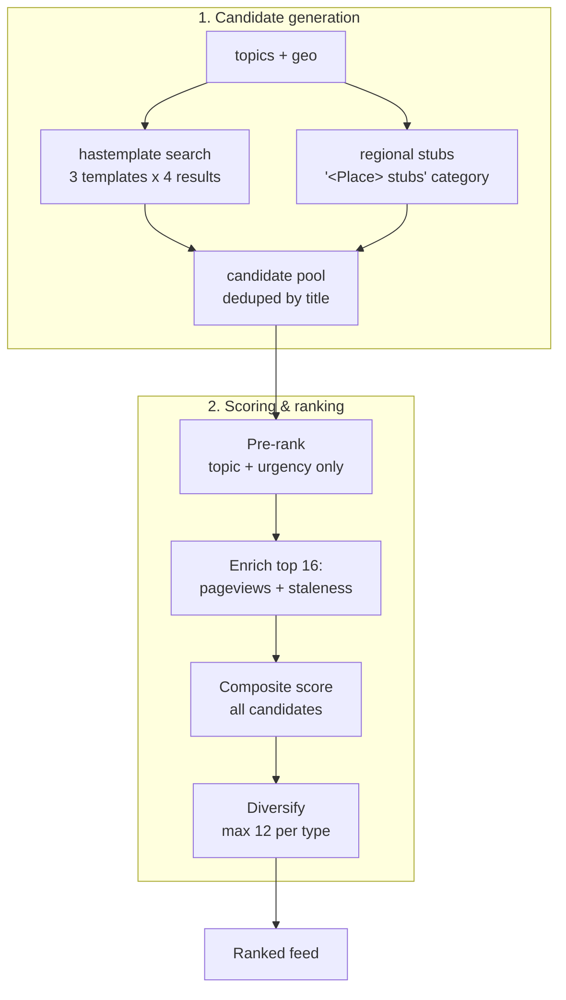

# Feature: Task Recommendations

**Endpoint:** `GET /api/tasks`
**Services:** `routes/tasks.py`, `services/scoring_service.py`
**UI:** Tasks view

This is the core feature — the ranked feed of maintenance work. Everything else in Compass exists to feed this.

---

## Request parameters

| Param | Format | Default | Effect |
|---|---|---|---|
| `topics` | comma-separated, **max 5** | *(none)* | Search queries **and** ranking weight |
| `editTypes` | comma-separated | *(none)* | Affinity bonus for matching task types |
| `geo` | single place name | *(none)* | Extra search topic **and** a large ranking bonus |

```
GET /api/tasks?topics=india,culture,history&editTypes=general,references,linking&geo=Kerala
```

> **Critical:** if `topics` is absent the backend falls back to a hardcoded generic list — `science, history, geography, biography, technology`. That fallback is the "generic global feed." The frontend must always send the user's real topics. See [[Known-Issues-and-Limitations]].

---

## Two-stage pipeline



---

## Stage 1 — Candidate generation

### Template search

For each topic, three searches run against MediaWiki's `hastemplate:` operator:

| Template | Task type | Reason shown |
|---|---|---|
| `Unreferenced` | `add_refs` | Needs references |
| `Orphan` | `fix_orphan` | Orphan article — add links from related pages |
| `Citation needed` | `add_citations` | Has [citation needed] tags — add inline sources |

Each returns up to **4** articles. So the pool is roughly `topics × 3 × 4`. With 3 topics plus a geo topic, that's ~48 candidates before dedup.

Titles are deduplicated globally by a `seen` set. **Order matters:** topics are searched in the order given and `geo` is appended *last*, so an article already found under `india` will not reappear under `Kerala`.

### Regional stub tasks

When `geo` is present, Compass tries Wikipedia's own stub-category naming convention:

```
Category:{geo} stubs      e.g. "Category:Kerala stubs"
```

It first calls `prop=categoryinfo` to check the category exists and has members. If not, it silently returns nothing — no hardcoded region list is needed; it just works for whichever places Wikipedia happens to name that way. Up to **5** members become `expand_stub` tasks.

---

## Stage 2 — Scoring

### The composite formula

```
score = 0.35 x topic_weight
      + 0.25 x urgency
      + 0.15 x pageview_score
      + 0.10 x effort_bonus
      + 0.10 x affinity
      + 0.10 x staleness
      +        trend_bonus      (0 or 0.05)
      +        geo_bonus        (0 or 0.40)
```

### Term by term

#### `topic_weight` (0.35) — how central is this topic to the user?

Topics are ranked, and weight decays with rank:

```
weight(rank i) = max(1 - i x 0.25, 0.15)
```

| Topic rank | Weight |
|---|---|
| 1st topic | 1.00 |
| 2nd topic | 0.75 |
| 3rd topic | 0.50 |
| Unlisted topic | 0.20 |
| `personal` (Revisit-sourced) | 0.90 |

The `personal` constant exists because watchlist/follow-up tasks concern articles the user has a direct history with — they're relevant by construction, regardless of topic ranking.

> **This is the single largest weight in the formula.** When `topics` is empty, every candidate gets the flat 0.20 fallback and this entire term becomes a constant — contributing *nothing* to ranking.

#### `urgency` (0.25) — how much does this task type matter?

| Task type | Urgency | Label | Effort | Est. minutes |
|---|---|---|---|---|
| `add_refs` | 0.75 | Add References | med | 20 |
| `followup` | 0.68 | Your Article | med | 20 |
| `watchlist` | 0.66 | Your Watchlist | med | 15 |
| `add_citations` | 0.65 | Add Citations | low | 10 |
| `expand_stub` | 0.45 | Expand Stub | low | 5 |
| `fix_orphan` | 0.38 | Fix Orphan | low | 5 |

Unreferenced content is the most damaging problem on Wikipedia, so it ranks highest. Orphans are a navigation nicety, so they rank lowest.

#### `pageview_score` (0.15) — will anyone read it?

```
pageview_score = min(avg_daily_views / 500, 1)
```

500 daily views is treated as "high impact"; anything above saturates. This is what stops the feed filling up with obscure articles nobody reads.

#### `staleness` (0.10) — how neglected is it?

```
staleness = min(days_since_touched / 365, 1)
```

One year untouched saturates the term.

#### `affinity` (0.10) — has the user done this kind of work before?

Task types map to the profile's edit-type keys:

| Task type | Matching edit types |
|---|---|
| `add_refs`, `add_citations` | `references` |
| `fix_orphan` | `linking`, `wikilinks` |
| `watchlist` | `general`, `references` |
| `followup` | `creation`, `major_add` |

If the user's top edit types intersect the task's set, a bonus applies.

#### `effort_bonus` (0.10) — quick wins

Applies when the task's effort is `low`, or it's explicitly flagged `isQuick`.

#### `trend_bonus` (+0.05 flat) — momentum

Applied when 7-day pageviews are up more than **30%** versus the prior 7 days.

#### `geo_bonus` (+0.40 flat) — regional relevance

Applied when `task.topic == geo` exactly. This is by far the largest single bonus — enough to lift a regional article above a nationally popular one.

> **Two limitations.** It's an *exact string match*, so an article found under "Ernakulam district" gets nothing when `geo` is "Kerala" — even though both came from the same resolved hierarchy. And it's a flat cliff: a place the user edited 112 times and one they edited 3 times score identically.

### A scaling inconsistency worth knowing

`effort_bonus` and `affinity` are each computed as `0.1 if condition else 0`, then **multiplied by 0.1** in the formula. Their real maximum contribution is therefore **0.01**, not 0.10 — roughly 40× smaller than the table implies. `staleness` and `pageview_score`, by contrast, are true 0–1 values, so their coefficients apply as written.

In practice this means effort and affinity are near-decorative in the current ranking. Documented rather than silently changed, since fixing it shifts every score. See [[Known-Issues-and-Limitations]].

---

## Bounded enrichment — why only 16 candidates get real data

Pageview and staleness lookups are expensive: one HTTP request per article for pageviews, plus a batched call for staleness.

So scoring runs in two passes:

1. **Pre-rank** all candidates using only `topic_weight + urgency` — free, no I/O.
2. **Enrich the top 16** (`pageview_sample=16`) with real pageview and staleness data.
   - Pageviews: `ThreadPoolExecutor(max_workers=8)`, one call each.
   - Staleness: a single batched `prop=info` call (MediaWiki caps `titles` at 50).
3. **Score everything.** Candidates outside the top 16 get `pageviews = 0` and `staleDays = 0`.

**Consequence:** an article that would have scored well on popularity alone can never climb into contention if its topic and urgency are weak, because it never gets its pageviews measured. This is an intentional latency bound, not an oversight.

---

## Diversification

Without a cap, `add_refs` — the highest-urgency type — would monopolize the entire feed.

After sorting by score, results are partitioned:

- The first **12 per type** (`max_per_type=12`) go into the head.
- Any overflow goes into the tail, still in score order.
- Final result is `head + tail`.

**Nothing is dropped** — the feed stays complete, just re-ordered so the top is varied.

---

## Response shape

```json
[
  {
    "title": "Kerala Sahitya Akademi",
    "type": "add_refs",
    "topic": "Kerala",
    "reason": "Needs references — Kerala",
    "meta": { "label": "Add References", "effort": "med", "min": 20 },
    "score": 0.657,
    "pageviews": 142,
    "trend": 12,
    "staleDays": 88
  }
]
```

---

## Worked example

User: `topics=india,culture,history`, `editTypes=general,references,…`, `geo=Kerala`.

| Candidate | topic_weight | urgency | pageviews | geo | Score |
|---|---|---|---|---|---|
| *The Times of India* — `add_refs` | 1.00 (`india`, rank 1) → 0.350 | 0.75 → 0.1875 | high → ~0.15 | — | **0.699** |
| *Kerala Sahitya Akademi* — `add_refs` | 0.20 (`Kerala` unlisted) → 0.070 | 0.75 → 0.1875 | low | +0.40 | **0.657** |
| *Cognitive science* — `add_refs` | 0.20 → 0.070 | 0.75 → 0.1875 | low | — | **~0.26** |

The generic-topic article lands far below both personalized ones. Before the topics fix, *every* candidate scored like that third row — which is exactly why the feed looked generic.
