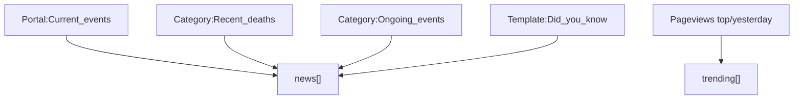

# Feature: Trends

**Endpoint:** `GET /api/trends`
**Service:** `services/trends_service.py`
**UI:** Overview sidebar (Trending + In the news cards)

The only endpoint that is **not personalized**. It provides ambient context: what's happening on Wikipedia right now, so an editor can spot timely opportunities that no profile analysis would surface.

---

## Five sources, fetched in parallel

All five run concurrently via `ThreadPoolExecutor(max_workers=5)`, so total latency is the slowest source, not the sum.



| Source | Method | Params | Cap |
|---|---|---|---|
| Current events | `action=parse` on `Portal:Current_events`, `section=0` | `prop=text` | 25 |
| Recent deaths | `list=categorymembers` on `Category:Recent_deaths` | `cmsort=timestamp`, `cmdir=desc`, `cmnamespace=0` | 12 |
| Ongoing events | `list=categorymembers` on `Category:Ongoing_events` | `cmtype=page`, `cmnamespace=0` | 12 |
| Did you know | `action=parse` on `Template:Did_you_know` | `prop=text` | 10 |
| Trending pages | Pageviews REST `top/en.wikipedia/{yyyy}/{mm}/{dd}` | yesterday's date | 30 |

---

## HTML list parsing

Two sources (Current events, DYK) have no structured API — they're wiki pages. Compass parses their rendered HTML with regex:

| Regex | Purpose |
|---|---|
| `LI_RE` — `<li[^>]*>([\s\S]*?)</li>` | Extract each list item |
| `LINK_RE` — `<a[^>]+title="([^"]+)"[^>]*>` | Pull linked article titles |
| `TAG_RE` — `<[^>]+>` | Strip tags to plain text |

Filtering rules:

- Items with fewer than **15 characters** of text are skipped (navigation cruft).
- Titles containing `:` are skipped — that's a namespace prefix (`Portal:`, `File:`), not an article.
- Items with **no article links at all** are dropped, since there'd be nothing to click.
- Text is whitespace-collapsed and truncated to 200 chars.

> Regex-parsing HTML is fragile by nature. If Wikipedia restructures these portal pages, these sources silently return `[]` — the app keeps working, just with less news. That tradeoff is deliberate.

## Trending filter

From the Pageviews top list, these are excluded:

- `Special:`, `Wikipedia:`, `Portal:` prefixes
- `Main_Page`
- The literal `-` entry

Yesterday's date is used because the current day's pageview data is incomplete.

---

## Response shape

```json
{
  "news": [
    {
      "text": "2026 Bangkok pub fire — at least 12 people died…",
      "articles": ["2026 Bangkok pub fire", "Bangkok"],
      "source": "current_events"
    },
    {
      "text": "Garfield Sobers — recently deceased",
      "articles": ["Garfield Sobers"],
      "source": "recent_deaths"
    }
  ],
  "trending": [
    { "title": "Lamine Yamal", "views": 1200431, "source": "wiki_trending" }
  ]
}
```

Every item carries a `source` tag (`current_events`, `recent_deaths`, `ongoing`, `dyk`, `wiki_trending`) so the UI can label provenance.

## UI behavior

Rendered as two Overview sidebar cards. Every article title links into the **Guide view** rather than out to Wikipedia — clicking a trending article runs Compass's structural analysis on it, turning a news item into an actionable editing opportunity.

## Refresh

The top bar's refresh button calls `loadTrends()` and `loadTasks()` together. Trends is the one endpoint cheap enough to re-fetch freely — no user analysis, no Wikidata walk.

## A note on `wiki_get`

This module owns the `wiki_get` helper that **task search also uses**. It originally had no retry and no timeout, so a rate-limited search raised straight through into callers' `except Exception: return []` — silently turning throttling into "no results," which produced empty or half-filled task feeds. It now retries on HTTP 429 with `Retry-After` backoff, matching `profile_service._wiki_get`. See [[Known-Issues-and-Limitations]].
