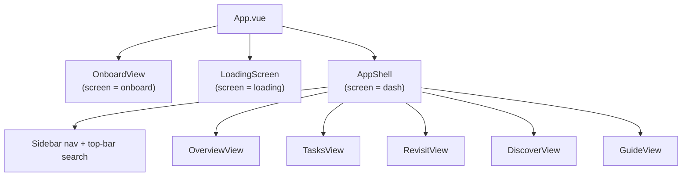
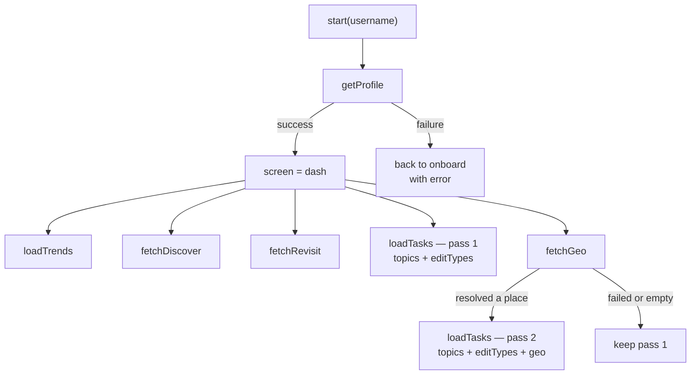

# Frontend State

**Store:** `frontend/src/stores/appStore.js` (Pinia)
**API layer:** `frontend/src/api.js`

There is exactly **one** store and **one** API module. Components never call `fetch` directly — with one intentional exception, the Guide view, whose data is per-search and not shared app state.

---

## Component tree



`screen` controls the top-level swap; `activeView` controls which view renders inside the shell.

---

## State shape

| Group | Fields |
|---|---|
| Session | `screen`, `username`, `onboardError`, `activeView` |
| Profile | `profile` — gates the transition out of onboarding |
| Trends | `trends`, `trendsLoading` |
| Tasks | `tasks`, `tasksLoading`, `tasksRequestSeq` |
| Discover | `discover`, `discoverLoading`, `discoverError` |
| Revisit | `revisit`, `revisitLoading`, `revisitError` |
| Geo | `geo`, `geoLoading`, `geoError` |
| Guide search | `guideQuery`, `guideQuerySeq` |

Each async feature carries its own `*Loading` and (where user-visible) `*Error` field, so one slow or failed source never blocks the rest of the dashboard.

---

## Load choreography

This is the most important thing to understand about the frontend.



**Profile is the gate.** Nothing else starts until it resolves, because every other call needs something from it. After that, five requests fan out in parallel.

### Why Tasks loads twice

Geo is by far the slowest call ([[Feature-Geographic-Focus]] explains why). Two earlier designs both failed:

| Design | Problem |
|---|---|
| Block tasks until geo resolves | User stares at a spinner for a minute or two |
| Load tasks once in geo's `.finally` | If geo failed, tasks loaded **unpersonalized and were never retried** — the user was stuck on a generic feed permanently |

The current design gets the best of both: **pass 1** fires immediately with `topics` + `editTypes` (already personalized, arrives in seconds), and **pass 2** re-ranks with `geo` once it resolves. If geo fails or resolves to nothing, pass 2 is skipped and pass 1 stands.

### The `tasksRequestSeq` guard

Two in-flight task requests plus a manual refresh button means responses can arrive out of order — and the slower, *older* request would otherwise win.

```js
const seq = ++this.tasksRequestSeq
getTasks({...})
  .then((ts) => { if (this.tasksRequestSeq === seq) this.tasks = ts })
```

Each call claims a sequence number and only applies its result if no newer call has started. Stale responses are discarded.

---

## Getters

### `geoFocusName`

Reduces the geo hierarchy to the single string `/api/tasks` accepts:

> The most-frequent place that is **not** itself a top-level country; fall back to the country if nothing more specific exists.

For `India 130, Kerala 112, Ernakulam district 45` this yields **"Kerala"** — country-level is too broad to be a useful regional signal.

### `topEditTypes`

`profile.editTypes` is a histogram (`{general: 788, references: 363, …}`). The backend's affinity map wants labels, so this sorts by count and takes the top 6 keys.

---

## Actions

| Action | Behavior |
|---|---|
| `start(username)` | Validates input, fetches profile, then fans out. On failure returns to onboarding with an error. |
| `loadTrends()` | Keeps last-known trends on failure (no error surfaced — trends are ambient). |
| `loadTasks()` | Sends `topics` + `editTypes` + `geo`. Sequence-guarded. |
| `fetchDiscover()` / `fetchRevisit()` / `fetchGeo()` | Set their own loading/error state. `fetchGeo` additionally triggers task pass 2. |
| `goTo(view)` | Switches `activeView`. |
| `searchGuide(title)` | Sets `guideQuery`, bumps `guideQuerySeq`, jumps to Guide view. |
| `logout()` | Resets all state back to onboarding. |

### `guideQuerySeq`

Any component can dispatch a Guide search from anywhere (top bar, a trending item, a task card). If a user searches the **same title twice**, `guideQuery` doesn't change, so a plain watcher wouldn't fire. Bumping a counter alongside it makes the search re-trigger reliably.

---

## API layer conventions

`api.js` exports one function per endpoint. Two error styles:

```js
// Endpoints whose errors carry a useful message
.then((r) => {
  if (!r.ok) return r.json().then((e) => { throw new Error(e.error || '…') })
  return r.json()
})

// Endpoints where the status alone is enough
.then((r) => {
  if (!r.ok) throw new Error('Failed to load tasks (' + r.status + ')')
  return r.json()
})
```

`getTasks` takes an **options object** rather than positional arguments:

```js
getTasks({ topics, editTypes, geo })
```

All three params are optional and only appended when non-empty. This shape exists specifically because the original positional `getTasks(geo)` signature made it easy to forget the other two signals — which is exactly the bug that caused the generic-feed problem.

`API_BASE` is hardcoded to `http://127.0.0.1:5000`. Deploying anywhere real means making this an environment variable.

---

## UI conventions

- **Wikimedia Codex** components throughout (`CdxButton`, `CdxInfoChip`, `CdxToggleButtonGroup`, …) so Compass feels native to the Wikipedia ecosystem.
- Filter buttons are **client-side only** — no refetch on filter change. Revisit goes further and builds its filter list dynamically from tags actually present in the data.
- Every article title links to both **View** (`/wiki/Title`) and **Edit on Wikipedia** (`?action=edit`), with titles URL-encoded and spaces converted to underscores.
- While geo is still resolving, Tasks shows an inline notice that results will be re-ranked, and Overview's dispatch card reads "*N* tasks ready — refining for your region…". Loading states never block already-usable content.
