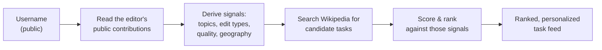

# Compass — Developer Wiki

**Your Wikipedia, Curated.** A personalized task recommender for Wikipedia editors.

Compass takes a public Wikipedia username, studies that editor's actual contribution history, and returns a ranked list of maintenance work suited to them — instead of the generic "articles needing references" dump every other tool produces.

There are no accounts, no database, and no signup. Everything is derived live from public Wikimedia APIs.

---

## The core idea in one picture



Every feature in Compass is a variation on this loop: *derive a signal from the user's own history, then use it to filter or rank public Wikipedia data.*

---

## Start here

| If you want to… | Read |
|---|---|
| Run the project locally | [[Getting-Started]] |
| Understand how the pieces fit together | [[Architecture]] |
| Know which external APIs we call and why | [[External-APIs]] |
| Look up an endpoint's request/response shape | [[API-Reference]] |
| Understand how the ranking actually works | [[Feature-Task-Recommendations]] |
| Understand frontend state and load order | [[Frontend-State]] |
| Know what's broken or approximated | [[Known-Issues-and-Limitations]] |

## Features

Compass has seven user-facing features. Each has its own page covering data sources, parameters, processing, and how results are tailored.

| Feature | What it answers | Page |
|---|---|---|
| **Editor Profile** | Who is this editor, and what are they good at? | [[Feature-Editor-Profile]] |
| **Tasks** | What maintenance work should they do next? | [[Feature-Task-Recommendations]] |
| **Geographic Focus** | Where in the world do they edit? | [[Feature-Geographic-Focus]] |
| **Revisit** | Which of *their own* articles have decayed? | [[Feature-Revisit]] |
| **Discover** | What could they write that's missing in their languages? | [[Feature-Discover]] |
| **Article Guide** | How exactly do I improve *this* article? | [[Feature-Article-Guide]] |
| **Trends** | What's happening on Wikipedia right now? | [[Feature-Trends]] |

---

## Project layout

```
backend/          Flask API
  app.py          App factory — auto-registers every blueprint in routes/
  routes/         HTTP layer: one blueprint per feature
  services/       Logic layer: API clients, parsing, scoring
frontend/         Vue 3 + Vite SPA
  src/api.js      Every backend call, one function each
  src/stores/     Pinia store — all app state and load choreography
  src/components/ Shell, views (one per feature), small widgets
legacy/           Original single-file vanilla JS prototype (inactive)
wiki/             This documentation
```

## Tech stack

- **Backend** — Python, Flask, `flask-cors`, `requests`. No database, no auth, no persistence.
- **Frontend** — Vue 3 (Composition API), Vite, Pinia, and [Wikimedia Codex](https://doc.wikimedia.org/codex/latest/) for UI components so it looks native to the Wikipedia ecosystem.
- **Data** — MediaWiki Action API, Wikidata, Wikimedia Pageviews, Semantic Scholar, CrossRef, PubMed.
